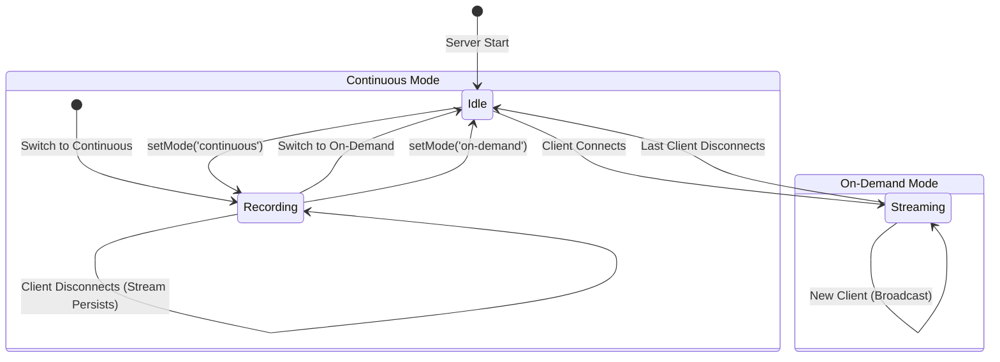

# Croissant

A real-time video streaming application featuring a Node.js WebSocket stream server and a Next.js web interface.

## Project Structure

- `stream-server/`: Node.js server that streams video via WebSocket using MJPEG.
- `web/`: Next.js web application for viewing the live stream.

## Prerequisites

- Node.js (v18+ recommended)
- npm or yarn or pnpm
- ffmpeg (required for the stream server)

## Getting Started

### 1. Stream Server

The stream server reads a video file and broadcasts it over a WebSocket connection.

1. Navigate to the server directory:
   ```bash
   cd stream-server
   ```

2. Install dependencies:
   ```bash
   npm install
   ```

3. Start the server:
   ```bash
   npm run dev
   ```
   The server will start on `http://localhost:8080`.

   > **Note:** The server expects a video file named `maru.mp4` in the `stream-server` directory.

### 2. Web Interface

The web interface connects to the stream server to display the video feed.

1. Navigate to the web directory:
   ```bash
   cd web
   ```

2. Install dependencies:
   ```bash
   npm install
   ```

3. Start the development server:
   ```bash
   npm run dev
   ```
   The app will run on `http://localhost:3000`.

## Usage

1. Ensure both the stream server and web app are running.
2. Open your browser and go to [http://localhost:3000/stream](http://localhost:3000/stream).
3. Click the **START STREAM** button.

## Configuration

### Web App
You can configure the WebSocket URL by setting the `WS_URL` environment variable.
- Default: `ws://localhost:8080` (or inferred from the browser's hostname if not set).

To set it locally, create a `.env.local` file in the `web` directory:
```
WS_URL=wss://your-server-url
```

## Streaming & Recording Flow

The server operates in two modes: **On-Demand** and **Continuous**.

### State Machine Diagram



### Flow Details

1.  **On-Demand Mode (Default)**
    *   **Start**: When a client connects (`ws.on('message', 'start')`), `startStreamIfNeeded()` spawns `rpicam-vid`.
    *   **Stop**: When the last client disconnects, `stopStreamIfNoClients()` kills the `rpicam-vid` process.
    *   **Recording**: Recording is disabled.

2.  **Continuous Mode**
    *   **Start**: When switched to continuous mode (`setMode('continuous')`), `rpicam-vid` is spawned immediately if not running.
    *   **Recording**: `startRecording()` is called. It spawns `ffmpeg` and pipes the camera output (`rpiProcess.stdout`) to `ffmpeg.stdin`. This process persists regardless of client connections.
    *   **Clients**: New clients simply subscribe to the existing broadcast frames. Disconnecting clients do *not* stop the stream server.
    *   **Persistence**: If the stream was already running (from On-Demand), switching to Continuous immediately attaches the `ffmpeg` recording process to the existing stream.

### Auto Recording
*   **Rotation**: Recordings are split into 5-minute MP4 segments.
*   **Retention**: A ring buffer ensures only the latest 36 recordings (and their thumbnails) are kept.
*   **Thumbnails**: Generated automatically every minute for efficient client-side preview.

### Graceful Shutdown
The server handles termination signals (`SIGINT`, `SIGTERM`) to ensure data integrity. When the server stops:
1. It stops accepting new connections.
2. It signals the `ffmpeg` process to finish the current recording segment.
3. It waits for `ffmpeg` to exit cleanly, ensuring the MP4 file trailer is written and the file is not corrupted.

## Technical Details

### MJPEG Stream Parsing

The server streams video using the **MJPEG** (Motion JPEG) format, which treats a video as a sequence of distinct JPEG images. The client parses this stream by looking for the byte markers that define the start and end of each JPEG image.

#### Magic Numbers

- **`0xFF, 0xD8` (SOI - Start of Image)**: These two bytes mark the beginning of a JPEG image.
- **`0xFF, 0xD9` (EOI - End of Image)**: These two bytes mark the end of the JPEG image.

#### Why Two Bytes?

We use a two-byte sequence because a single byte like `0xFF` (255) is not unique enough. In a photograph, `0xFF` represents a very bright pixel value and occurs frequently. If we used `0xFF` as a marker, the parser would incorrectly cut the image every time it encountered a white pixel.

The JPEG standard uses `0xFF` as a "prefix" byte.
- `0xFF` followed by `0xD8` means "Start of Image".
- `0xFF` followed by `0x00` means "Literal 255" (a regular pixel value, not a marker).

#### What if the image actually contains 0xFF?
If the compressed image data naturally contains the byte 0xFF, the standard requires it to be written as 0xFF 0x00.

The parser sees 0xFF, looks at the next byte (0x00), and knows "Ah, this isn't a marker, this is just a literal 255 value".

This system ensures that the markers can be reliably detected within the binary stream without conflict.
